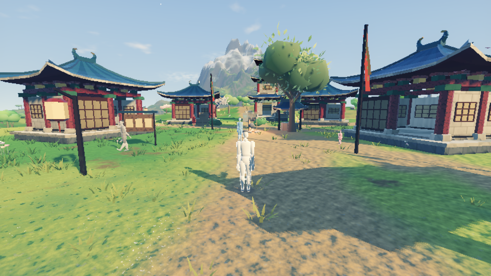
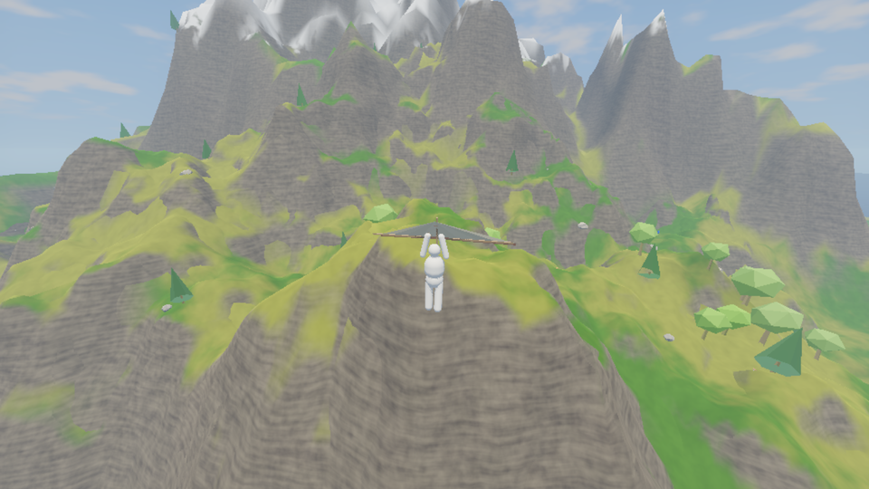
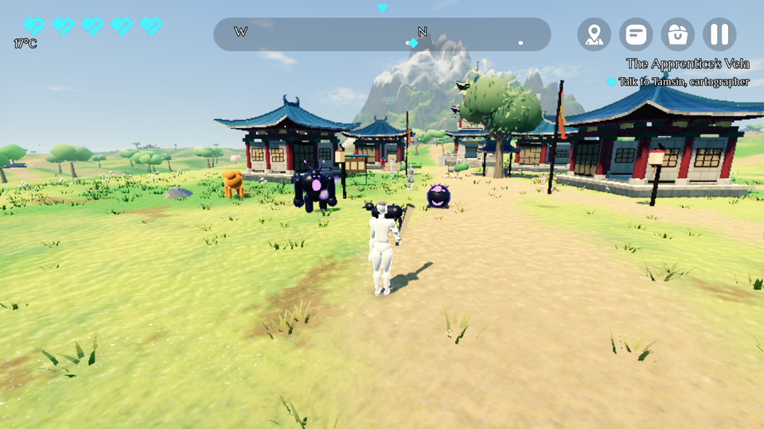
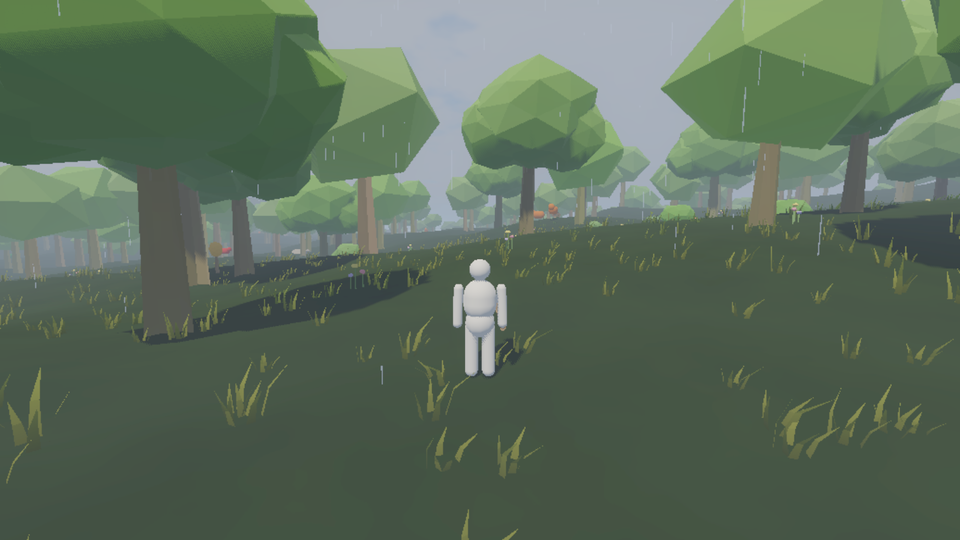
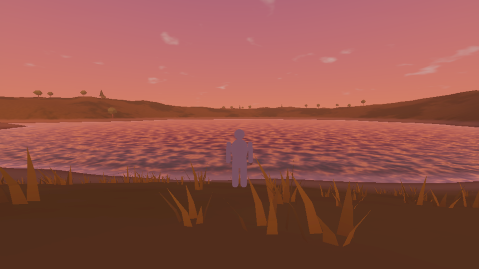
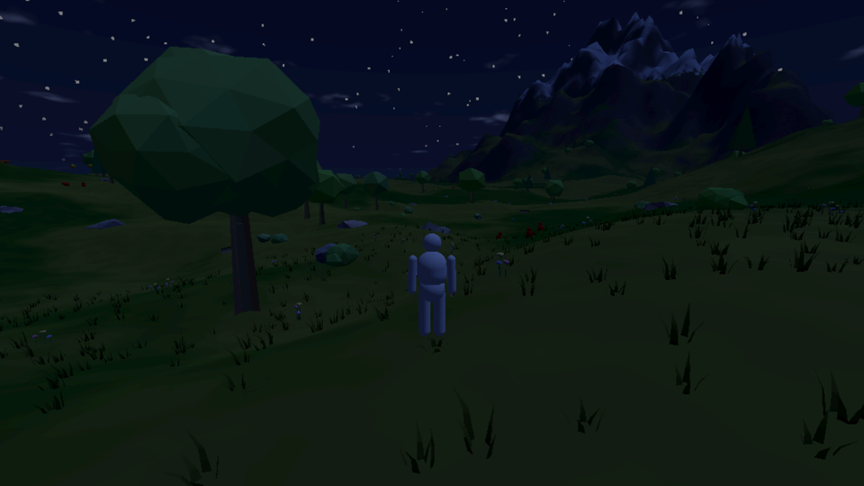
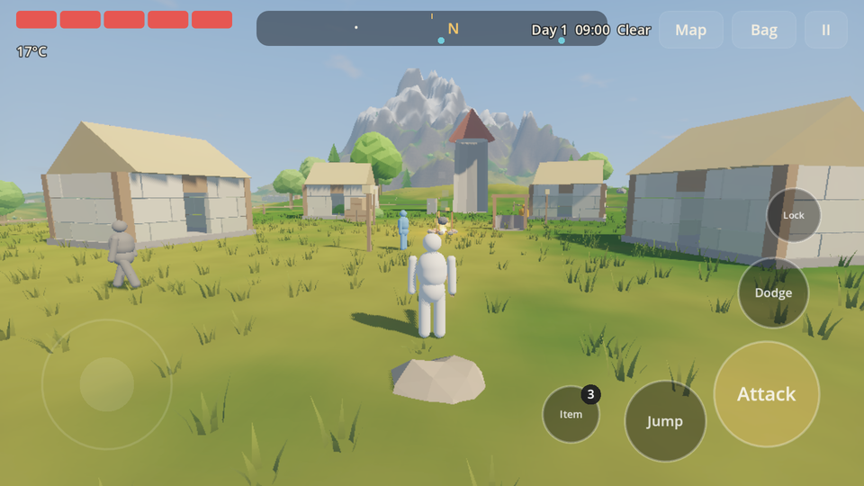

# VELA — aventura open world 3D para iOS y Android

> Título de trabajo. Mundo, personajes, historia y sistemas originales.
> Inspiración **solo de filosofía de diseño** (libertad, descubrimiento, sistemas emergentes); ningún nombre, arte, lore o asset de Nintendo.

VELA es un juego de exploración en una isla continua: ves una montaña, una aguja de roca o una ruina en el horizonte y **puedes llegar**. Para eso escalas cualquier pared, planeas con la *Vela de Brisa* y usas el fuego, el viento y el clima a tu favor.

Estado: **segunda etapa**: slice ampliado con dirección de arte propia (fantasía de inspiración china original: jade, bermellón y niebla de tinta), misiones, jefes, montura, desierto y zona sobrenatural. Todos los personajes y enemigos son *placeholders* intencionales: el jugador es blanco y cada especie tiene un color sólido único. Están listos para reemplazarse por los modelos finales sin tocar el gameplay.



| | |
|---|---|
|  |  |
|  |  |
|  |  |

## Qué contiene el vertical slice

| Área | Contenido |
|---|---|
| Mundo | Isla de ~1,8 km con streaming de sectores (64 m) en hilos de trabajo, LOD de terreno y árboles, baldosas de horizonte con árboles impostores, 5 regiones (valle, bosque, altos, lago, costa), 11 lugares descubribles |
| Movimiento | Caminar, correr, sprint, salto (con salto en sprint y *coyote time*), **escalada real** (aguante, salto de escalada, trepado al borde, roca mojada que resbala), **planeo** (inercia, viento, corrientes térmicas), natación, esquiva con *i-frames* |
| Combate | Combos, ataque cargado por tipo de arma (giro, estocada, golpe al suelo, proyectil de fuego), ataque en picado, bloqueo + **parry**, **esquiva perfecta** con cámara lenta, ataque sigiloso x2, *aim-assist* táctil, *lock-on*, *hitstop* y vibración |
| Armas | 6 armas con daño, velocidad, alcance, arco, peso y durabilidad; reliquias que se mellan en vez de romperse; afiladores y piedra de forja |
| Enemigos / IA | 4 especies y 1 jefe definido: idle, patrulla, investigar, perseguir, atacar, retirada, búsqueda, huida, sueño y reacción. Vista, oído y consciencia gradual. Alertas de grupo. Simulación por distancia (completa / reducida / dormida) |
| Mundo vivo | Animales en manada que pastan, duermen y huyen del jugador, de los depredadores y de las explosiones. NPCs con rutina horaria y diálogo |
| Sistemas | Fuego que se propaga por la hierba seca y genera térmicas, lluvia que apaga el fuego y moja superficies, rayos atraídos por el metal, explosiones, cajas, barriles y rocas físicas |
| Supervivencia | Temperatura por altitud, noche y clima. Comida que cura o da buffs. Cocina experimental con recetas secretas y fabricación |
| Clima / hora | Despejado, nublado, lluvia, tormenta, niebla, viento y nieve; ciclo día/noche completo que afecta a la IA, las luces y la música |
| UI | Controles táctiles contextuales multi-touch, brújula sin GPS, mapa con niebla de exploración, inventario, fabricación, cocina y ajustes completos |
| Guardado | Autosave (nunca en combate), guardado al pasar a segundo plano, escritura atómica y backup |
| Dirección de arte | Etalonaje por LUT (sombras frías, luces cálidas), cielo pintado con dos capas de nubes, bancos de niebla entre planos de profundidad, cascadas, terreno jade con senderos y humedad, 9 especies de árbol, arquitectura original de los "Guardianes del Viento" con HLOD por estructura. Ver [docs/ART_DIRECTION.md](docs/ART_DIRECTION.md) |
| Progresión | 10 misiones (3 actos principales + 7 secundarias) con diario y rastreador; 3 jefes con arenas, fases y telegrafías; 5 habilidades; montura domable; puzzles (braseros, placas, anclas); comercio con moneda; eventos dinámicos |
| Regiones nuevas | Desierto (calor, tormentas de arena, oasis, cripta de arenisca) y los Confines del Velo (lago inmóvil, islas flotantes con levedad, anclas) |
| UI | Estilo "laca y oro": fuentes Marcellus/Philosopher, paneles achaflanados con filetes dorados, glifos propios, brújula-pergamino, tarjetas de título, placa de jefe, barras de pincel |
| Plataforma | 8 idiomas, calidad adaptativa (LOW–ULTRA), resolución dinámica, gobernador térmico, capa iOS/Android para IAP, anuncios con recompensa y analítica opcional |

## Empezar

Requisitos: **Godot 4.4.1** (estándar, GDScript; no hace falta la versión .NET).

```bash
godot --editor --path .          # abrir en el editor
godot --path .                   # jugar (pantalla de título)
godot --path . -- --new-game     # saltar directamente a una partida nueva
```

Controles de escritorio para probar: WASD / ratón · Espacio saltar / planear · Shift sprint · clic izq. atacar (mantener = cargado) · clic der. bloquear · Q esquivar · E interactuar · R usar objeto · F cambiar arma · Tab fijar objetivo · I bolsa · M mapa · Esc menú · F1 consola de debug. Los mandos también funcionan. Más detalle en [docs/CONTROLS.md](docs/CONTROLS.md).

## Tests

```bash
godot --headless --path . -- --unit     # 80 tests unitarios y de datos
godot --headless --path . -- --systems  # 46 comprobaciones de misiones, jefes, montura, puzzles, tienda, eventos y regiones
godot --headless --path . -- --smoke    # 36 comprobaciones de gameplay de principio a fin
godot --path . -- --tour /tmp/shots     # capturas de referencia (necesita GPU)
```

El *smoke test* recorre la checklist del primer build: carga del mundo, caminar, sprint, saltar, escalar un muro y trepar al borde, planear, combatir, durabilidad, recolectar, comer, equipar, explosión por fuego, clima y hora, **guardar → cerrar → continuar → progreso recuperado**. La CI (`.github/workflows/tests.yml`) ejecuta los tres en cada push.

## Documentación

- [Arquitectura](docs/ARCHITECTURE.md): capas, flujo de datos, cómo añadir contenido
- [Sistemas](docs/SYSTEMS.md): propósito, dependencias, uso y extensión de cada sistema
- [Assets y placeholders](docs/ASSETS.md): **cómo reemplazar placeholders por tus modelos finales**
- [Rendimiento móvil](docs/PERFORMANCE.md): presupuestos, mediciones reales, ajustes
- [Controles](docs/CONTROLS.md) · [Build y exportación](docs/BUILD.md) · [Debug](docs/DEBUG.md) · [Publicación](docs/PUBLISHING.md) · [Diseño y hoja de ruta](docs/DESIGN.md)

## Estructura

```
data/            contenido JSON (objetos, entidades, regiones, botín, recetas, clima, mundo)
localization/    strings.csv (8 idiomas), generado por tools/gen_localization.py
assets/          shaders, iconos SVG, audio (placeholders reemplazables)
scenes/          boot, main_menu, game (mínimas; el mundo se compone en código)
src/autoload/    servicios globales (datos, ajustes, calidad, input, reloj, clima, guardado…)
src/world/       streaming, terreno, horizonte, estructuras, POIs, spawns, entorno, agua
src/player/      cuerpo, estados de movimiento, combate, vitales
src/ai/          criaturas, percepción, cerebro y estados, gestor por distancia
src/entities/    EntityVisual: placeholder o modelo final (única capa visual)
src/combat/ src/physics/ src/interaction/ src/items/ src/crafting/ src/ui/ src/fx/ src/platform/
tests/           unit_tests, smoke_test, systems_test, screenshot_tour
tools/           generadores (localización, iconos, audio) y utilidades de terreno
```
